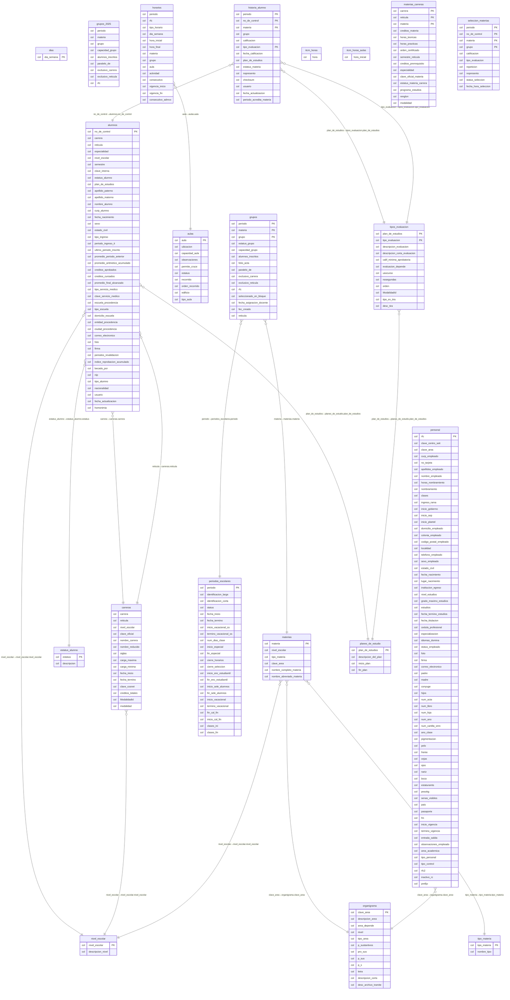

# ERD bdtec (Mermaid)

```mermaid
erDiagram
  alumnos {
    col no_de_control PK
    col carrera
    col reticula
    col especialidad
    col nivel_escolar
    col semestre
    col clave_interna
    col estatus_alumno
    col plan_de_estudios
    col apellido_paterno
    col apellido_materno
    col nombre_alumno
    col curp_alumno
    col fecha_nacimiento
    col sexo
    col estado_civil
    col tipo_ingreso
    col periodo_ingreso_it
    col ultimo_periodo_inscrito
    col promedio_periodo_anterior
    col promedio_aritmetico_acumulado
    col creditos_aprobados
    col creditos_cursados
    col promedio_final_alcanzado
    col tipo_servicio_medico
    col clave_servicio_medico
    col escuela_procedencia
    col tipo_escuela
    col domicilio_escuela
    col entidad_procedencia
    col ciudad_procedencia
    col correo_electronico
    col foto
    col firma
    col periodos_revalidacion
    col indice_reprobacion_acumulado
    col becado_por
    col nip
    col tipo_alumno
    col nacionalidad
    col usuario
    col fecha_actualizacion
    col homonimia
  }

  aulas {
    col aula PK
    col ubicacion
    col capacidad_aula
    col observaciones
    col permite_cruce
    col estatus
    col recorrido
    col orden_recorrido
    col edificio
    col tipo_aula
  }

  carreras {
    col carrera
    col reticula
    col nivel_escolar
    col clave_oficial
    col nombre_carrera
    col nombre_reducido
    col siglas
    col carga_maxima
    col carga_minima
    col fecha_inicio
    col fecha_termino
    col clave_cosnet
    col creditos_totales
    col ModalidadId
    col modalidad
  }

  dias {
    col dia_semana PK
  }

  estatus_alumno {
    col estatus PK
    col descripcion
  }

  grupos {
    col periodo PK
    col materia PK
    col grupo PK
    col estatus_grupo
    col capacidad_grupo
    col alumnos_inscritos
    col folio_acta
    col paralelo_de
    col exclusivo_carrera
    col exclusivo_reticula
    col rfc
    col seleccionado_en_bloque
    col fecha_asignacion_docente
    col fec_creado
    col reticula
  }

  grupos_2025 {
    col periodo
    col materia
    col grupo
    col capacidad_grupo
    col alumnos_inscritos
    col paralelo_de
    col exclusivo_carrera
    col exclusivo_reticula
    col rfc
  }

  historia_alumno {
    col periodo PK
    col no_de_control PK
    col materia PK
    col grupo
    col calificacion
    col tipo_evaluacion PK
    col fecha_calificacion
    col plan_de_estudios
    col estatus_materia
    col nopresento
    col checksum
    col usuario
    col fecha_actualizacion
    col periodo_acredita_materia
  }

  horarios {
    col periodo
    col rfc
    col tipo_horario
    col dia_semana
    col hora_inicial
    col hora_final
    col materia
    col grupo
    col aula
    col actividad
    col consecutivo
    col vigencia_inicio
    col vigencia_fin
    col consecutivo_admvo
  }

  itcm_horas {
    col hora
  }

  itcm_horas_aulas {
    col hora_inicial
  }

  materias {
    col materia PK
    col nivel_escolar
    col tipo_materia
    col clave_area
    col nombre_completo_materia
    col nombre_abreviado_materia
  }

  materias_carreras {
    col carrera PK
    col reticula PK
    col materia PK
    col creditos_materia
    col horas_teoricas
    col horas_practicas
    col orden_certificado
    col semestre_reticula
    col creditos_prerrequisito
    col especialidad
    col clave_oficial_materia
    col estatus_materia_carrera
    col programa_estudios
    col renglon
    col modalidad
  }

  nivel_escolar {
    col nivel_escolar PK
    col descripcion_nivel
  }

  organigrama {
    col clave_area PK
    col descripcion_area
    col area_depende
    col nivel
    col tipo_area
    col p_sustantivos
    col pro_sus
    col p_sus
    col p_s
    col letra
    col descripcion_corta
    col desc_archivo_tramite
  }

  periodos_escolares {
    col periodo PK
    col identificacion_larga
    col identificacion_corta
    col status
    col fecha_inicio
    col fecha_termino
    col inicio_vacacional_ss
    col termino_vacacional_ss
    col num_dias_clase
    col inicio_especial
    col fin_especial
    col cierre_horarios
    col cierre_seleccion
    col inicio_enc_estudiantil
    col fin_enc_estudiantil
    col inicio_sele_alumnos
    col fin_sele_alumnos
    col inicio_vacacional
    col termino_vacacional
    col fin_cal_fin
    col inicio_cal_fin
    col clases_ini
    col clases_fin
  }

  personal {
    col rfc PK
    col clave_centro_seit
    col clave_area
    col curp_empleado
    col no_tarjeta
    col apellidos_empleado
    col nombre_empleado
    col horas_nombramiento
    col nombramiento
    col clases
    col ingreso_rama
    col inicio_gobierno
    col inicio_sep
    col inicio_plantel
    col domicilio_empleado
    col colonia_empleado
    col codigo_postal_empleado
    col localidad
    col telefono_empleado
    col sexo_empleado
    col estado_civil
    col fecha_nacimiento
    col lugar_nacimiento
    col institucion_egreso
    col nivel_estudios
    col grado_maximo_estudios
    col estudios
    col fecha_termino_estudios
    col fecha_titulacion
    col cedula_profesional
    col especializacion
    col idiomas_domina
    col status_empleado
    col foto
    col firma
    col correo_electronico
    col padre
    col madre
    col conyuge
    col hijos
    col num_acta
    col num_libro
    col num_foja
    col num_ano
    col num_cartilla_smn
    col ano_clase
    col pigmentacion
    col pelo
    col frente
    col cejas
    col ojos
    col nariz
    col boca
    col estaturamts
    col pesokg
    col senas_visibles
    col pais
    col pasaporte
    col fm
    col inicio_vigencia
    col termino_vigencia
    col entrada_salida
    col observaciones_empleado
    col area_academica
    col tipo_personal
    col tipo_control
    col rfc2
    col inactivo_rc
    col prefijo
  }

  planes_de_estudio {
    col plan_de_estudios PK
    col descripcion_del_plan
    col inicio_plan
    col fin_plan
  }

  seleccion_materias {
    col periodo PK
    col no_de_control PK
    col materia PK
    col grupo PK
    col calificacion
    col tipo_evaluacion
    col repeticion
    col nopresento
    col status_seleccion
    col fecha_hora_seleccion
  }

  tipo_materia {
    col tipo_materia PK
    col nombre_tipo
  }

  tipos_evaluacion {
    col plan_de_estudios PK
    col tipo_evaluacion PK
    col descripcion_evaluacion
    col descripcion_corta_evaluacion
    col calif_minima_aprobatoria
    col evaluacion_depende
    col usocurso
    col nosegundas
    col orden
    col ModalidadId
    col tipo_ev_tira
    col desc_tira
  }


  alumnos }o--|| carreras : "carrera→carreras.carrera"
  alumnos }o--|| estatus_alumno : "estatus_alumno→estatus_alumno.estatus"
  alumnos }o--|| nivel_escolar : "nivel_escolar→nivel_escolar.nivel_escolar"
  alumnos }o--|| planes_de_estudio : "plan_de_estudios→planes_de_estudio.plan_de_estudios"
  alumnos }o--|| carreras : "reticula→carreras.reticula"
  carreras }o--|| nivel_escolar : "nivel_escolar→nivel_escolar.nivel_escolar"
  grupos }o--|| materias : "materia→materias.materia"
  grupos }o--|| periodos_escolares : "periodo→periodos_escolares.periodo"
  historia_alumno }o--|| alumnos : "no_de_control→alumnos.no_de_control"
  historia_alumno }o--|| tipos_evaluacion : "plan_de_estudios→tipos_evaluacion.plan_de_estudios"
  historia_alumno }o--|| tipos_evaluacion : "tipo_evaluacion→tipos_evaluacion.tipo_evaluacion"
  horarios }o--|| aulas : "aula→aulas.aula"
  materias }o--|| nivel_escolar : "nivel_escolar→nivel_escolar.nivel_escolar"
  materias }o--|| organigrama : "clave_area→organigrama.clave_area"
  materias }o--|| tipo_materia : "tipo_materia→tipo_materia.tipo_materia"
  personal }o--|| organigrama : "clave_area→organigrama.clave_area"
  tipos_evaluacion }o--|| planes_de_estudio : "plan_de_estudios→planes_de_estudio.plan_de_estudios"
```